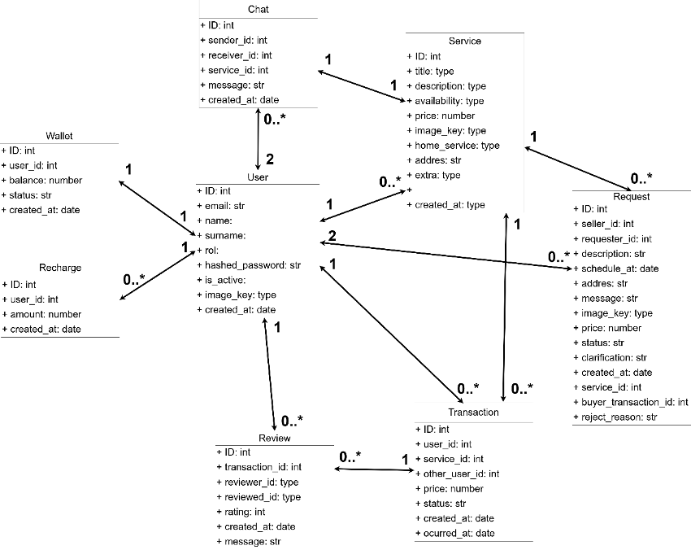
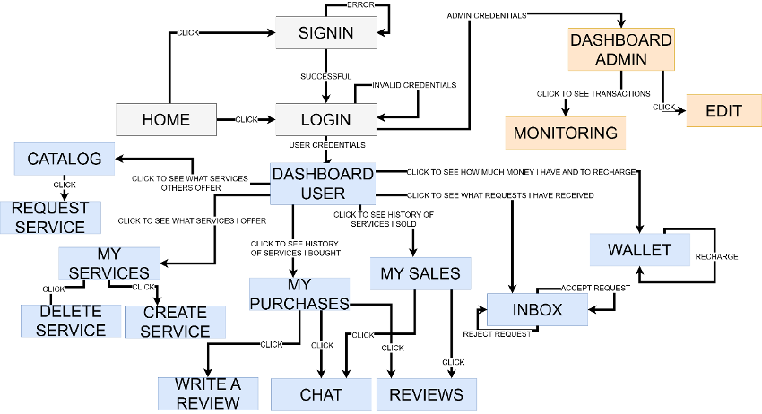
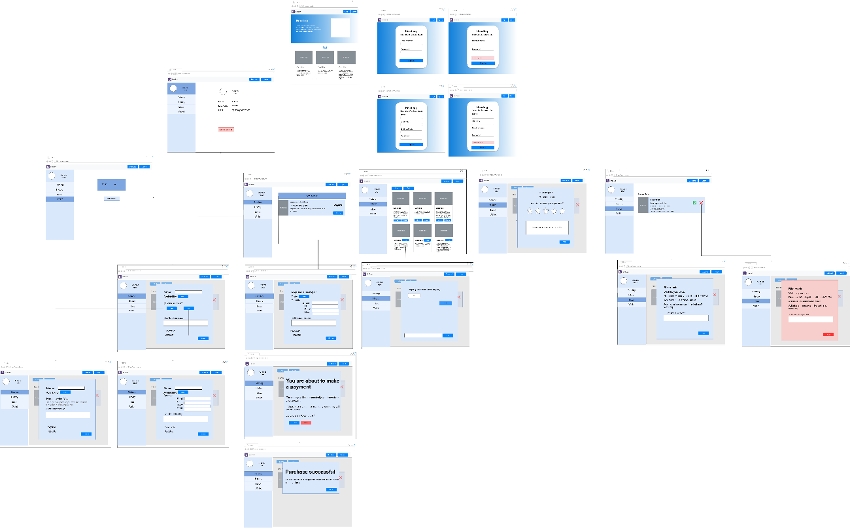

# Time Bank


**UNIVERSITY OF CASTILLA-LA MANCHA**

**Carlota Moreno Tirado**  
**Belén Huertas Ruiz**

**School of Computer Science**

**Subject:** Web Systems Design  
**Degree:** Bachelor's Degree in Computer Engineering  
**Date:** 20/02/2026

---

## Index

- [Project Overview](#project-overview)
- [Technology Stack](#technology-stack)
- [Content Diagram](#content-diagram)
  - [Main Entities](#main-entities)
  - [Main Relationships](#main-relationships)
- [Navigation Diagram](#navigation-diagram)
- [Presentation Diagram](#presentation-diagram)
- [API Dictionary](#api-dictionary)
  - [Health](#health)
  - [Authenticated User](#authenticated-user)
  - [User Portal](#user-portal)
  - [Chat](#chat)
  - [Reviews](#reviews)
  - [Users](#users)
  - [Administration](#administration)
  - [Authentication](#authentication)
- [Main Data Types](#main-data-types)
- [User Guide](#user-guide)

---

## Project Overview

Time Bank is a web application for exchanging services through a virtual currency based on time credits. Users can publish services, request services offered by other users, manage received requests, chat with other users, check their purchase and sale history, review transactions, and recharge their wallet.

The system is divided into two repositories:

- **Frontend:** <https://github.com/carlotamorenouclm/TimeBankFront>
- **Backend:** <https://github.com/carlotamorenouclm/TimeBankBack>
- **Models:** <https://drive.google.com/file/d/1-dKTxqYtD5g7gQ12-faBSI_ctbbNoa47/view?usp=sharing>

## Technology Stack

- **Frontend:** React, Vite, React Router, React Bootstrap, and Bootstrap.
- **Backend:** FastAPI, SQLAlchemy, Pydantic, and JWT authentication.
- **Database:** MySQL with PyMySQL.
- **Authentication:** OAuth2 Password Form with Bearer JWT tokens.
- **Payments:** Stripe Checkout and Stripe webhooks for wallet recharges.

## Content Diagram



### Main Entities

| Entity | Main fields |
|---|---|
| `User` | `id`, `email`, `hashed_password`, `name`, `surname`, `avatar_key`, `role`, `is_active`, `created_at` |
| `ServiceOffer` | `id`, `owner_id`, `title`, `description`, `availability`, `home_service`, `address`, `extra`, `price`, `image_key`, `owner_name`, `is_visible`, `created_at` |
| `ServiceRequest` | `id`, `receiver_id`, `requester_id`, `service_offer_id`, `buyer_transaction_id`, `requester_name`, `service`, `description`, `scheduled_at`, `address`, `message`, `image_key`, `price`, `status`, `clarification`, `reject_reason`, `created_at` |
| `UserWallet` | `id`, `user_id`, `balance`, `status`, `created_at` |
| `WalletRecharge` | `id`, `user_id`, `amount`, `created_at` |
| `UserTransaction` | `id`, `user_id`, `type`, `service`, `other_user`, `amount`, `status`, `occurred_at`, `created_at` |
| `ChatMessage` | `id`, `request_id`, `thread_key`, `sender_id`, `receiver_id`, `message`, `sent_at` |
| `TransactionReview` | `id`, `transaction_id`, `reviewer_id`, `reviewed_user_id`, `rating`, `comment`, `created_at` |

### Main Relationships

- A user can publish zero or more services.
- A user has one associated wallet.
- A wallet can receive zero or more recharges.
- A user can have zero or more transactions.
- A user can send and receive zero or more service requests.
- A service offer can generate zero or more service requests.
- A transaction can be linked to a service request.
- A service request or thread can contain zero or more chat messages.
- A transaction can receive reviews related to the users involved.

## Navigation Diagram



## Presentation Diagram



## API Dictionary

### Health

| Method | Endpoint | Authentication | Description | Request body | Response |
|---|---|---|---|---|---|
| GET | `/health` | No | Checks that the backend is available. | None | `{ "status": "ok" }` |

### Authenticated User

| Method | Endpoint | Authentication | Description | Request body | Response |
|---|---|---|---|---|---|
| GET | `/me` | User | Returns the authenticated user's profile. | None | `UserOut` |
| POST | `/me/update` | User | Updates the authenticated user's profile. | `email`, `name`, `surname`, `avatar_key` | `UserOut` |
| POST | `/me/password` | User | Changes the authenticated user's password. | `current_password`, `new_password` | Text confirmation |
| DELETE | `/me/delete` | User | Deletes the authenticated user's account. | None | Empty 204 response |
| POST | `/me/isAdmin` | User | Indicates whether the authenticated user has the administrator role. | None | `true` or `false` |

### User Portal

| Method | Endpoint | Authentication | Description | Request body | Response |
|---|---|---|---|---|---|
| GET | `/portal/summary` | User | Returns the summary displayed in the sidebar. | None | `PortalUserSummary` |
| GET | `/portal/dashboard` | User | Returns the available services and the user's own services. | None | `DashboardResponse` |
| GET | `/portal/history` | User | Returns the user's purchase and sale history. | None | `HistoryResponse` |
| POST | `/portal/history/notifications/read` | User | Marks purchase or sale notifications as read. | `{ "transaction_type": "Purchase" }` or `{ "transaction_type": "Sale" }` | `PortalUserSummary` |
| GET | `/portal/inbox` | User | Returns received service requests. | None | `InboxResponse` |
| POST | `/portal/inbox/{request_id}/accept` | User | Accepts a received request. | `{ "clarification": "..." }` | Updated `InboxResponse` |
| POST | `/portal/inbox/{request_id}/reject` | User | Rejects a received request. | `{ "reason": "..." }` | Updated `InboxResponse` |
| POST | `/portal/requests/{request_id}/complete` | User | Completes an accepted request and updates the history. | None | `HistoryResponse` |
| GET | `/portal/wallet` | User | Returns wallet balance, status, and recharges. | None | `WalletResponse` |
| POST | `/portal/wallet/recharge` | User | Legacy manual recharge route. It currently rejects the operation and requires Stripe Checkout. | `{ "amount": 10 }` | Error 400 |
| POST | `/portal/wallet/checkout-session` | User | Creates a Stripe Checkout session to recharge the wallet. | `{ "amount": 10 }` | `StripeCheckoutSessionResponse` |
| POST | `/portal/wallet/checkout-session/{session_id}/confirm` | User | Checks the status of a Checkout session and returns the wallet. | None | `WalletResponse` |
| POST | `/portal/stripe/webhook` | Stripe | Receives signed Stripe events and credits paid wallet recharges. | Stripe payload and `stripe-signature` header | `{ "received": true }` |
| POST | `/portal/services/{service_offer_id}/request` | User | Requests a service and deducts the payment from the wallet. | `scheduled_at`, `street`, `street_number`, `floor`, `door`, `message` | `CreateServiceRequestResponse` |
| POST | `/portal/services` | User | Publishes a new service offer. | `title`, `description`, `availability`, `home_service`, address, `extra`, `price`, `image_key` | `CreateServiceOfferResponse` |
| DELETE | `/portal/services/{service_offer_id}` | User | Deletes one of the user's own services. | None | `DeleteServiceOfferResponse` |

### Chat

| Method | Endpoint | Authentication | Description | Request body | Response |
|---|---|---|---|---|---|
| GET | `/chat/requests/{request_id}/messages` | User | Lists the messages associated with a request. | None | `ChatMessagesResponse` |
| POST | `/chat/requests/{request_id}/messages` | User | Sends a message within a request. | `{ "message": "..." }` | `ChatMessagesResponse` |
| GET | `/chat/threads/{thread_key}/messages` | User | Lists the messages in a chat thread. | None | `ChatMessagesResponse` |
| POST | `/chat/threads/{thread_key}/messages` | User | Sends a message within a thread. | `{ "receiver_id": 2, "message": "..." }` | `ChatMessagesResponse` |

### Reviews

| Method | Endpoint | Authentication | Description | Request body | Response |
|---|---|---|---|---|---|
| POST | `/reviews` | User | Creates a review associated with a transaction. | `transaction_id`, `rating`, `comment` | `CreateReviewResponse` |
| GET | `/reviews/services/{service_offer_id}` | User | Returns the reviews for a service. | None | `TransactionReviewOut[]` |
| GET | `/reviews/{transaction_id}` | User | Returns the reviews for a transaction. | None | `TransactionReviewOut[]` |

### Users

| Method | Endpoint | Authentication | Description | Request body | Response |
|---|---|---|---|---|---|
| POST | `/users/signup` | No | Creates a new user account. | `email`, `password`, `name`, `surname` | `UserOut` |
| GET | `/users` | Administrator | Lists all users. | None | `UserOut[]` |
| GET | `/users/{user_id}` | Administrator | Returns a user by identifier. | None | `UserOut` |
| POST | `/users/update/{user_id}` | Administrator | Updates another user's public data. | `email`, `name`, `surname`, `avatar_key` | Text confirmation |
| DELETE | `/users/delete/{user_id}` | Administrator | Deletes a user by identifier. | None | Empty 204 response |

### Administration

| Method | Endpoint | Authentication | Description | Request body | Response |
|---|---|---|---|---|---|
| GET | `/admins` | Administrator | Lists accounts with the administrator role. | None | `UserOut[]` |
| POST | `/admins/updateRole/{user_id}` | Administrator | Changes a user's role. | `{ "new_role": "USER" }` or `{ "new_role": "ADMIN" }` | Text confirmation |
| POST | `/admins/update/is-active/{user_id}` | Administrator | Activates or deactivates a user account. | `{ "is_active": true }` | Text confirmation |
| POST | `/admins/wallet/balance/{user_id}` | Administrator | Modifies a user's wallet balance. | `{ "coins": 50 }` | `WalletResponse` |
| GET | `/admins/wallet/history?user_id={user_id}` | Administrator | Retrieves a user's wallet history. | None | `WalletResponse` |
| GET | `/admins/transaction/history?user_id={user_id}` | Administrator | Retrieves a user's transaction history. | None | `HistoryResponse` |
| GET | `/admins/reviews?user_id={user_id}` | Administrator | Lists the reviews related to a user. | None | `TransactionReviewOut[]` |
| GET | `/admins/services?user_id={user_id}` | Administrator | Lists the services published by a user. | None | `ServiceOfferOut[]` |
| PATCH | `/admins/services/{service_offer_id}/visibility` | Administrator | Changes the visibility of a service offer. | `{ "is_visible": true }` | `ServiceOfferOut` |
| DELETE | `/admins/services/{service_offer_id}` | Administrator | Deletes a service offer from the administration area. | None | `DeleteServiceOfferResponse` |
| DELETE | `/admins/reviews/{review_id}` | Administrator | Deletes a review from the administration area. | None | Empty 204 response |

### Authentication

| Method | Endpoint | Authentication | Description | Request body | Response |
|---|---|---|---|---|---|
| POST | `/auth/token` | No | Logs in and returns a JWT. | `username`, `password` in `application/x-www-form-urlencoded` format | `{ "access_token": "...", "token_type": "bearer" }` |

## Main Data Types

### `UserOut`

| Field | Type | Description |
|---|---|---|
| `id` | integer | User identifier. |
| `email` | string | User email address. |
| `name` | string or null | First name. |
| `surname` | string or null | Last name. |
| `avatar_key` | string or null | Selected avatar key. |
| `role` | string | User role. |
| `is_active` | boolean | Account status. |

### `PortalUserSummary`

| Field | Type | Description |
|---|---|---|
| `id` | integer | User identifier. |
| `name` | string | Name displayed in the sidebar. |
| `role` | string | `USER` or `ADMIN`. |
| `email` | string | Email address. |
| `avatar_key` | string or null | Selected avatar key. |
| `pending_inbox_count` | integer | Pending requests in the inbox. |
| `pending_purchases_count` | integer | Pending purchase updates. |
| `pending_sales_count` | integer | Pending sale updates. |

### `ServiceOfferOut`

| Field | Type | Description |
|---|---|---|
| `id` | integer | Service identifier. |
| `owner_id` | integer or null | User who owns the service. |
| `title` | string | Service title. |
| `description` | string | Service description. |
| `availability` | string | Provider availability. |
| `home_service` | boolean | Indicates whether the service is performed at the requester's home. |
| `address` | string or null | Provider address when the service is not home based. |
| `extra` | string or null | Additional information. |
| `price` | integer | Price in coins. |
| `image_key` | string | Image key used by the frontend. |
| `owner_name` | string | Provider display name. |
| `is_visible` | boolean | Indicates whether the service is visible in the catalogue. |
| `overall_rating` | float or null | Average service rating. |

### `TransactionOut`

| Field | Type | Description |
|---|---|---|
| `id` | integer | Transaction identifier. |
| `request_id` | integer or null | Associated request. |
| `chat_key` | string or null | Associated chat thread key. |
| `other_user_id` | integer or null | Identifier of the other party. |
| `unread_count` | integer | Number of unread messages. |
| `has_unseen_update` | boolean | Indicates whether there is an unread update. |
| `has_unseen_review` | boolean | Indicates whether there is an unseen review. |
| `type` | string | `Purchase` or `Sale`. |
| `service` | string | Related service name. |
| `other_user` | string or null | Name of the other party. |
| `date` | string | Date in `YYYY-MM-DD` format. |
| `address` | string or null | Service address. |
| `amount` | integer | Coins transferred. |
| `status` | string | Transaction status. |
| `clarification` | string or null | Provider clarification when accepting a request. |
| `reject_reason` | string or null | Rejection reason. |

### `ChatMessagesResponse`

| Field | Type | Description |
|---|---|---|
| `messages` | `ChatMessageOut[]` | List of chat messages. |

### `TransactionReviewOut`

| Field | Type | Description |
|---|---|---|
| `id` | integer | Review identifier. |
| `transaction_id` | integer | Reviewed transaction. |
| `service` | string or null | Related service. |
| `reviewer_id` | integer | User who writes the review. |
| `reviewer_name` | string or null | Name of the user who writes the review. |
| `reviewed_user_id` | integer | Reviewed user. |
| `reviewed_user_name` | string or null | Name of the reviewed user. |
| `rating` | integer | Rating between 1 and 5. |
| `comment` | string or null | Review comment. |
| `created_at` | string | Creation date. |

## User Guide

### Installation and Local Execution

#### Frontend

**Prerequisites**

- Node.js 18 or higher.
- npm.

**Steps**

1. Open a terminal in the `TimeBankFront/timebank-front/` folder.
2. Create a `.env` file with the backend URL:

```env
VITE_API_URL=http://localhost:8000
```

3. Install the dependencies:

```bash
npm install
```

4. Run the development server:

```bash
npm run dev
```

The application usually starts at <http://localhost:5173>.

#### Backend

**Prerequisites**

- Python 3.10 or higher.
- MySQL server running locally or through Docker.

**Steps**

1. Open a terminal in the `TimeBankBack/` folder.
2. Create a virtual environment:

```bash
python -m venv .venv
```

3. Activate the virtual environment:

```bash
# Windows
.venv\Scripts\activate

# macOS/Linux
source .venv/bin/activate
```

4. Install the dependencies:

```bash
pip install -r requirements.txt
```

5. Configure the environment variables:

```env
DB_HOST=localhost
DB_PORT=3306
DB_NAME=timebank
DB_USER=<database-user>
DB_PASSWORD=<database-password>
SECRET_KEY=<secret-key>
ALGORITHM=HS256
ACCESS_TOKEN_EXPIRE_MINUTES=60
STRIPE_SECRET_KEY=<stripe-secret-key>
STRIPE_WEBHOOK_SECRET=<stripe-webhook-signing-secret>
STRIPE_CURRENCY=eur
STRIPE_COIN_UNIT_AMOUNT_CENTS=100
FRONTEND_URL=http://localhost:5173
```

6. Run the API:

```bash
uvicorn app.main:app --reload
```

### Regular User Guide

YouTube playlist with all user guide videos:  
<https://www.youtube.com/playlist?list=PL5ISQmiP9ucbDl44ZIRndhnTX8tamhMLy>

| Guide | Link |
|---|---|
| Create a user account | <https://youtu.be/aqFwQxqLiRQ> |
| Publish a service | <https://youtu.be/6jkrCT_v5A0> |
| Request a service | <https://youtu.be/EcFJ-h6j50s> |
| Delete a service | <https://youtu.be/LmMkdHiBGOc> |
| Accept a request in the inbox | <https://youtu.be/8n2TKm9yS9s> |
| Reject a request in the inbox | <https://youtu.be/nKFCpO84tHo> |
| Chat | <https://youtu.be/6PqKplIX1F0> |
| Wallet | <https://www.youtube.com/watch?v=0SwPBKf6YO4> |
| Reviews | <https://youtu.be/Q7kJC8p4IfI> |
| Profile | <https://youtu.be/CG-Kg5HE-jo> |

### Administrator Guide

Administrator guide video:  
<https://youtu.be/7uRWQPooUQk>
